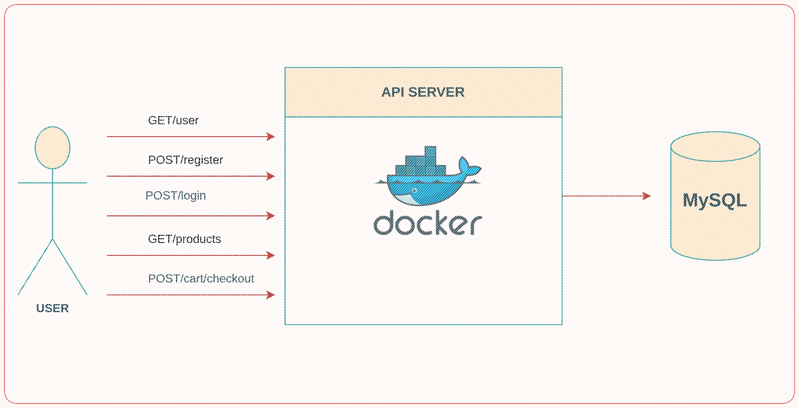

# GoECOM


It is a E-commerce REST API. 

<p align="center">
    
</p>

### Installation

There are a few tools that you need to install to run the project.
So make sure you have the following tools installed on your machine.

- [Migrate (for DB migrations)](https://github.com/golang-migrate/migrate/tree/v4.17.0/cmd/migrate)

## Running the project

Firstly make sure you have a MySQL database running on your machine or just swap for any storage you like under `/db`.

Then create a database with the name you want *(`ecom` is the default)* and run the migrations.

```bash
make migrate-up
```

After that, you can run the project with the following command:

```bash
make run
```

## Running the tests

To run the tests, you can use the following command:

```bash
make test
```

## How to contribute ?

Thank you for considering contributing to this project! We welcome your contributions and support in making this project better.

Contributions are welcome in the form of bug reports, feature requests, code changes, documentation updates, and more. To get started, please follow these steps:

1. **Create an Issue:**

   - If you find a bug or have a feature request, please create an issue.
   - Provide as much detail as possible, including the version of the project where you encountered the issue, your operating system, and steps to reproduce the problem.

2. **Fork the Repository:**

   - If you plan to make code contributions, fork the repository to your GitHub account.

3. **Make Changes:**

   - Create a new branch for your changes: `git checkout -b feature/your-feature` or `fix/your-fix`.
   - Make your changes, ensuring that your code follows the project's coding guidelines and standards.

4. **Test Your Changes:**

   - Ensure that your changes work as expected and do not introduce new issues.

5. **Submit a Pull Request:**

   - When you're ready to submit your changes, create a pull request from your fork to the main repository's `master` branch (or the relevant target branch).
   - In the pull request, provide a clear description of your changes and reference any related issues.

6. **Code Review:**

   - Your pull request will be reviewed by project maintainers. Please be responsive to any feedback or requested changes.

7. **Merge and Release:**
   - Once your changes are approved, they will be merged into the project. 

